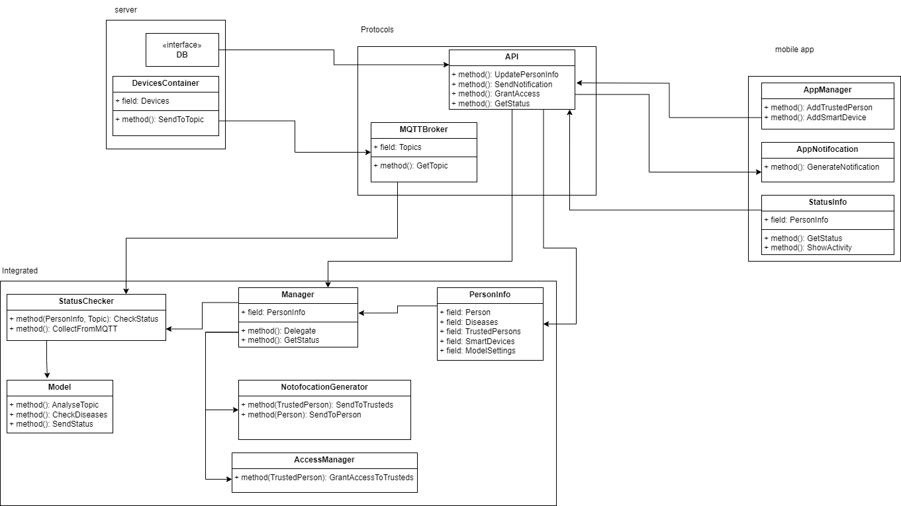

## Презентационный ТГ-бот системы оповещения родственников (доверенных лиц) при опасности у наблюдаемого (человека с ОВЗ)

**Структура кода:**
+ Файл `Main.cs` - точка входа программы бота. Создаёт его экземпляр и запускает обработку
+ Файл `Person.cs` - файл класса Человек, представляющий наблюдаемого
+ Файл `Core.cs` - файл логики самого бота

**Описание `class Person`**
> Содержит id аккаунта наблюдаемого человека, его имя, и список id аккаунтов его доверенных лиц \
Имя, id наблюдаемого можно считывать из экземпляра для нахождения нужного хоста в классе логики бота (`class Core`)\
Через метод `AddTrustedPerson` можно добавлять доверенное лицо к конкретному хосту

**Описание `class Core`**
> Здесь описана логика бота.\
Поля только 2: список клиентов (хостов) и переменная самого бота\
Функция `Work` выставляет настройки бота и запускает приём сообщений\
Функции `HandleTGUpdate` и `HandleTGError` соответственно обрабатывают обновления (сообщения) и ошибки из диалога с ботом\
Функция `HandleReply` обрабатывает ответы на сообщения бота, отправленные пользователем. Это помогает регистрировать хоста и доверенное лицо, ориентируясь на текст сообщения, на которое ответили\

**Описание `class Program`**
> Здесь находится точка входа в программу и только

## Запуск
+ Скачать и установить .NET 9.0
+ Скачать исходный код
+ Запустить команду `dotnet run`

## Текстовое описание архитектуры
> См. файл АРХИТЕКТУРА.pdf

## Макет приложения в Figma

https://www.figma.com/design/SAs5ifMicn4EGr9gjiVRhx/Фижма-в-хендехохово?node-id=0-1&t=Y0QFnALWY6jezssx-1

## Схема API

